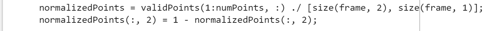

# Thermal Face Landmark Detection Tracker

This repository contains a MATLAB script for interactive facial landmark tracking on thermal video sequences. It captures user-selected points in the first frame, tracks them across all frames, and normalizes the output for downstream Blender alignment.

## Files

- feature_point.m - main MATLAB script that runs the point tracking workflow.
- README.docx - original Word document with step-by-step instructions.
- docs/images/ - assets extracted from the Word document for this README.

## Requirements

- MATLAB with Computer Vision Toolbox (for vision.PointTracker).
- Thermal video file (.wmv, .mp4, etc.).

## Usage

1. Open feature_point.m in MATLAB.
2. Configure these parameters near the top of the script:
   - videoFile - full path to the thermal video sequence.
   - outputFile - destination CSV file for tracked points.
   - numPoints - number of landmarks to track (typical value: 2).
3. Run the script. It displays the first video frame.
4. Click on each landmark in the order you want to track. When you have selected numPoints points, press Enter.
5. The script tracks the points frame-by-frame and writes normalized coordinates to outputFile.

## Output Format

The generated CSV file contains the following columns:

- Frame - frame index starting at 1.
- U_A, V_A, U_B, V_B, ... - normalized coordinates for each tracked point.

Normalization includes scaling by frame width/height and flipping the Y-axis to match Blender's coordinate system.

## Notes

- Heavy head motion can cause tracker drift. If that happens, reselect different landmarks and rerun the script.
- To adapt the output to other applications, edit the normalization section shown above and adjust the CSV writing logic.

