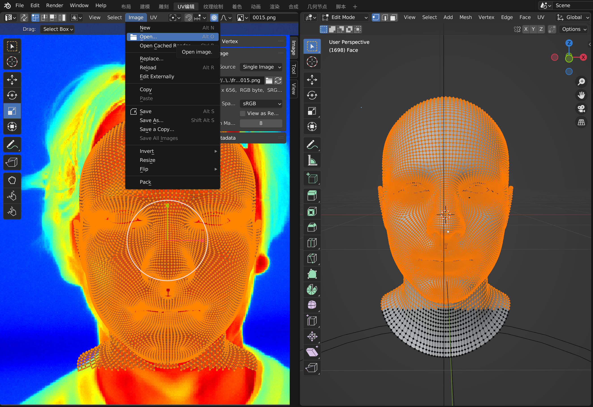
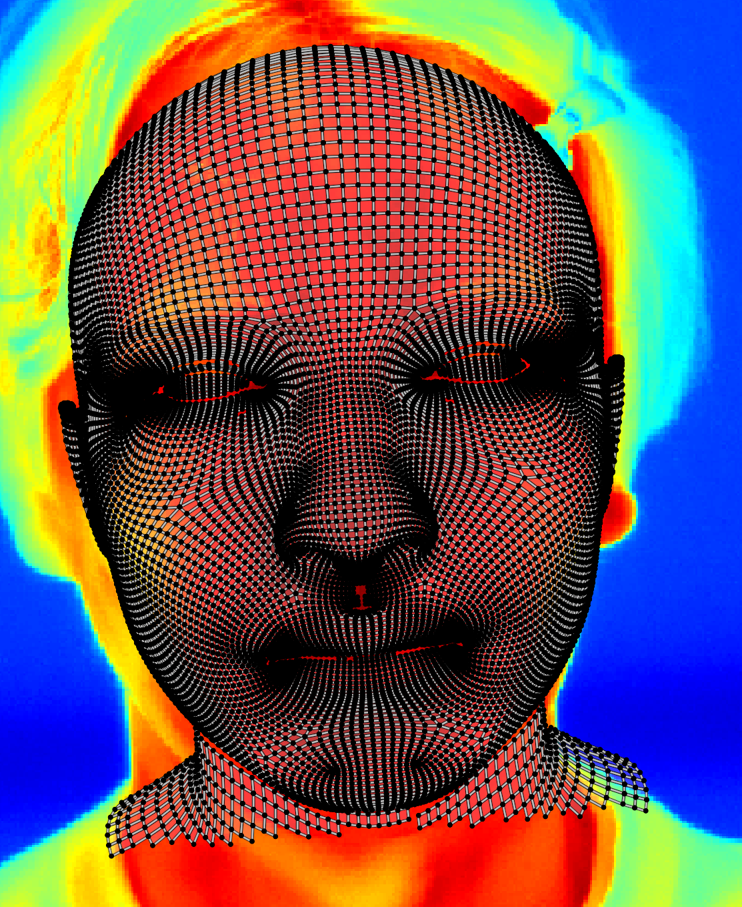
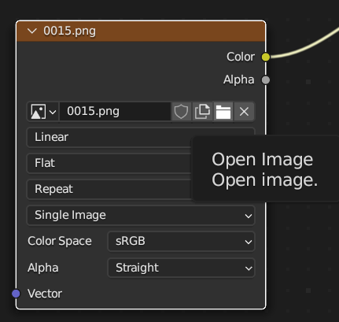
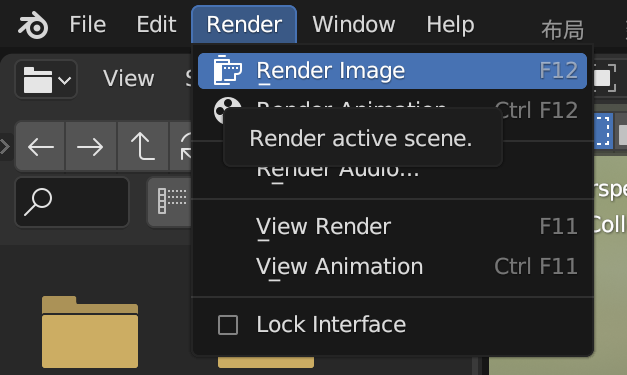
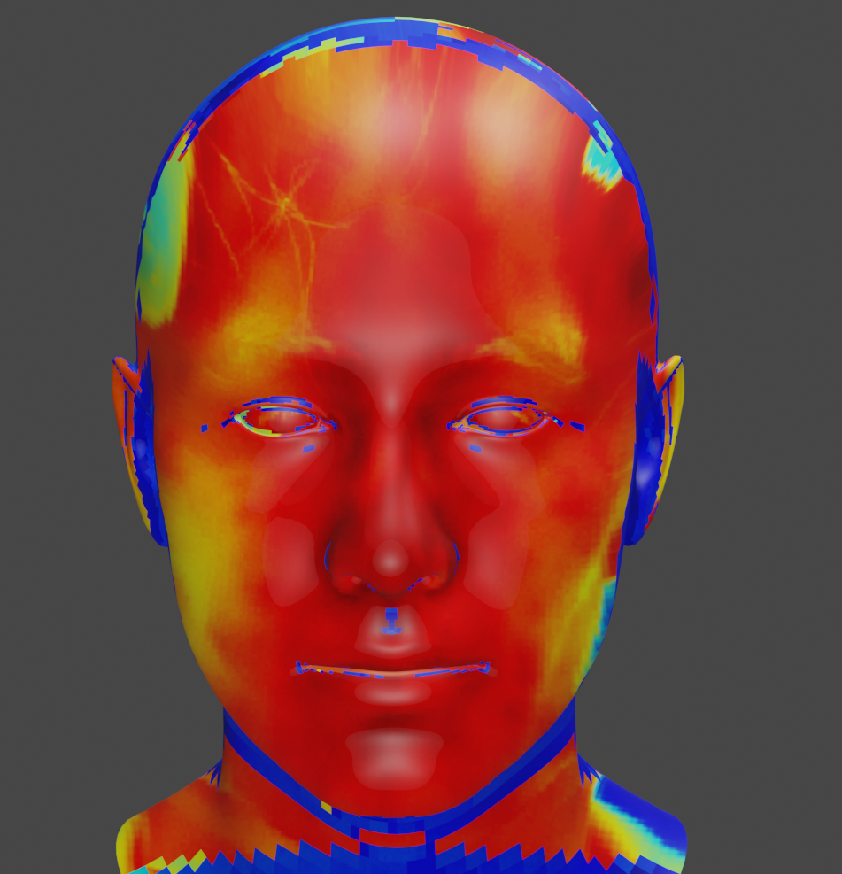

# Blender-Based Facial Nonlinear Alignment

This repository contains a Blender-based workflow for aligning a 3D facial mesh with thermal imaging video frames. The process starts with a manually aligned key frame and finishes with an automated script that propagates the deformation to the remaining frames.

## Project Files

- mapping.blend – main Blender scene with the mesh and node setup used for alignment.
- mapping.blend1 – backup copy of the Blender scene saved during iteration.
- docs/images/ – screenshots referenced in this README (extracted from the original Word guide).

## Prerequisites

- Blender 
- Thermographic image sequence for the subject you want to align
- Facial landmark detection results (JSON/CSV) that the alignment script consumes

## Workflow Overview

### 1. Prepare the First Frame

1. Open mapping.blend in Blender.
2. Import the first frame of the thermal video as a background image in the left image editor.
3. Ensure the frame is easy to see by adjusting zoom and view settings.

### 2. Manually Align the Mesh

- Select the facial mesh with the left mouse button.
- Use G to translate, the toolbar Scale gizmo to resize, and the rotation tool to adjust orientation.
- Scroll the mouse wheel to zoom and press the mouse wheel to pan.
- Press Tab to toggle mesh visibility and focus on specific areas.
- Iterate until the mesh closely matches the facial features in the thermal frame.

### 3. Validate Shading Before Rendering

1. Switch to the **Shading** workspace.
2. Load the same first-frame image into the node editor preview to confirm alignment.

3. From the **Render** menu, choose **Render Image** (or press F12) to produce a test render.

If the render looks correct, proceed to automation.

### 4. Configure the Auto-Alignment Script

1. Open the **Scripting** workspace in Blender.
2. Load the render/alignment script provided with your dataset.
3. Update these script parameters:
   - image_dir: directory containing ordered thermal video frames.
   - points_file: path to facial landmark detection data for each frame.
   - ase_render_path: destination folder for rendered alignment outputs.
4. Double-check the paths, then run the script to process all remaining frames.

### 5. Review Output

- The script will automatically align and render each frame.
- Inspect the exported frames under ase_render_path.
- Iterate on mesh adjustments if you see misalignments and re-run the script.

## Notes

- Keep the Blender project and reference data (frames + landmarks) in the same directory structure used when configuring the script to avoid hard-coded path issues.

